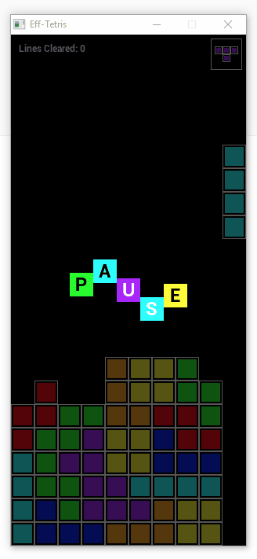

# Eff-Tetris
- A simple version of the tetris game written in golang using the effulgent media API
- 
- The game has the following features
    - Keyboard controls (the arrow keys to move the piece and space to drop it)
    - Title screen
    - Line clear count
    - Upcoming tetris piece preview
    - Pause menu, (access pause by pressing `P` during gameplay)
    - Game over state, returns to the main menu when the game is complete

## Build Instructions
- This game was made using the effulgent media API (https://github.com/forestgiant/eff), The needed version is vendored in the repo
- To build and run this game you will need SDL2 installed (https://github.com/forestgiant/eff#sdl-setup)
- Once SDL is installed run `go build` in the source folder, the needed assets are not embedded in the binary so the assets folder must be in the same directory as the binary